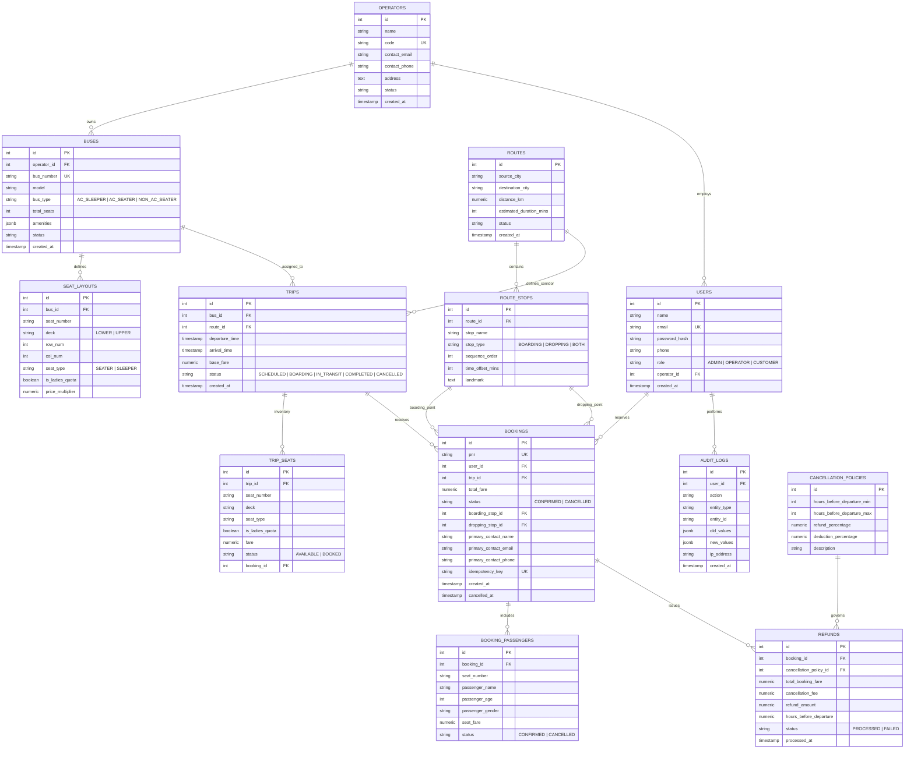

# Algions Bus Booking Management System - Entity Relationship Diagram

```mermaid
erDiagram
    OPERATORS ||--o{ BUSES : owns
    OPERATORS ||--o{ USERS : employs
    BUSES ||--o{ SEAT_LAYOUTS : defines
    BUSES ||--o{ TRIPS : assigned_to
    ROUTES ||--o{ ROUTE_STOPS : contains
    ROUTES ||--o{ TRIPS : defines_corridor
    TRIPS ||--o{ TRIP_SEATS : inventory
    TRIPS ||--o{ BOOKINGS : receives
    USERS ||--o{ BOOKINGS : reserves
    USERS ||--o{ AUDIT_LOGS : performs
    BOOKINGS ||--o{ BOOKING_PASSENGERS : includes
    BOOKINGS ||--o{ REFUNDS : issues
    ROUTE_STOPS ||--o{ BOOKINGS : boarding_point
    ROUTE_STOPS ||--o{ BOOKINGS : dropping_point
    CANCELLATION_POLICIES ||--o{ REFUNDS : governs

    OPERATORS {
        int id PK
        string name
        string code UK
        string contact_email
        string contact_phone
        text address
        string status
        timestamp created_at
    }

    USERS {
        int id PK
        string name
        string email UK
        string password_hash
        string phone
        string role "ADMIN | OPERATOR | CUSTOMER"
        int operator_id FK
        timestamp created_at
    }

    BUSES {
        int id PK
        int operator_id FK
        string bus_number UK
        string model
        string bus_type "AC_SLEEPER | AC_SEATER | NON_AC_SEATER"
        int total_seats
        jsonb amenities
        string status
        timestamp created_at
    }

    SEAT_LAYOUTS {
        int id PK
        int bus_id FK
        string seat_number
        string deck "LOWER | UPPER"
        int row_num
        int col_num
        string seat_type "SEATER | SLEEPER"
        boolean is_ladies_quota
        numeric price_multiplier
    }

    ROUTES {
        int id PK
        string source_city
        string destination_city
        numeric distance_km
        int estimated_duration_mins
        string status
        timestamp created_at
    }

    ROUTE_STOPS {
        int id PK
        int route_id FK
        string stop_name
        string stop_type "BOARDING | DROPPING | BOTH"
        int sequence_order
        int time_offset_mins
        text landmark
    }

    TRIPS {
        int id PK
        int bus_id FK
        int route_id FK
        timestamp departure_time
        timestamp arrival_time
        numeric base_fare
        string status "SCHEDULED | BOARDING | IN_TRANSIT | COMPLETED | CANCELLED"
        timestamp created_at
    }

    TRIP_SEATS {
        int id PK
        int trip_id FK
        string seat_number
        string deck
        string seat_type
        boolean is_ladies_quota
        numeric fare
        string status "AVAILABLE | BOOKED"
        int booking_id FK
    }

    CANCELLATION_POLICIES {
        int id PK
        int hours_before_departure_min
        int hours_before_departure_max
        numeric refund_percentage
        numeric deduction_percentage
        string description
    }

    BOOKINGS {
        int id PK
        string pnr UK
        int user_id FK
        int trip_id FK
        numeric total_fare
        string status "CONFIRMED | CANCELLED"
        int boarding_stop_id FK
        int dropping_stop_id FK
        string primary_contact_name
        string primary_contact_email
        string primary_contact_phone
        string idempotency_key UK
        timestamp created_at
        timestamp cancelled_at
    }

    BOOKING_PASSENGERS {
        int id PK
        int booking_id FK
        string seat_number
        string passenger_name
        int passenger_age
        string passenger_gender
        numeric seat_fare
        string status "CONFIRMED | CANCELLED"
    }

    REFUNDS {
        int id PK
        int booking_id FK
        int cancellation_policy_id FK
        numeric total_booking_fare
        numeric cancellation_fee
        numeric refund_amount
        numeric hours_before_departure
        string status "PROCESSED | FAILED"
        timestamp processed_at
    }

    AUDIT_LOGS {
        int id PK
        int user_id FK
        string action
        string entity_type
        string entity_id
        jsonb old_values
        jsonb new_values
        string ip_address
        timestamp created_at
    }
```
